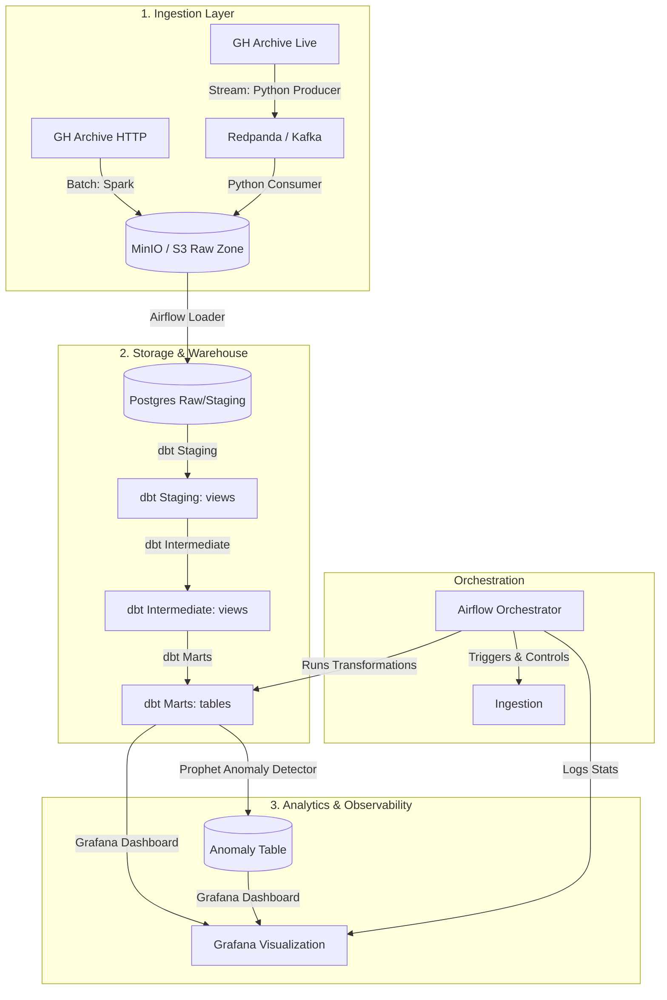
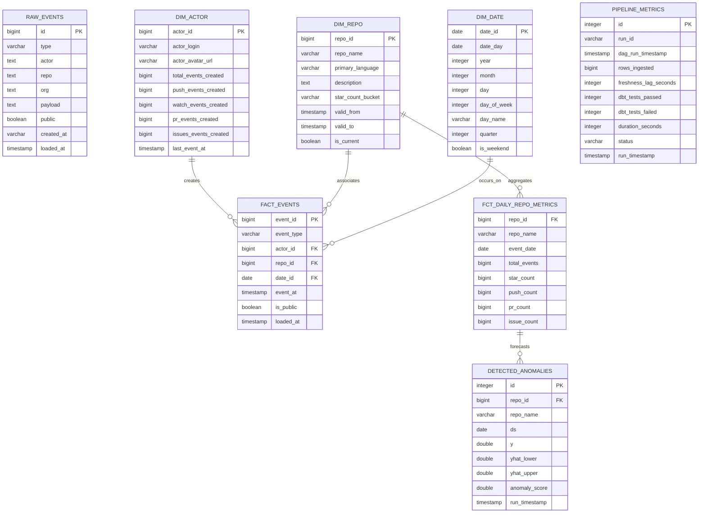

# GitPulse 

GitPulse is a real-time and batch data platform that ingests GitHub's public event stream (GH Archive hourly dumps), lands it in an S3-compatible Parquet lakehouse, and builds a Type-2 slowly changing dimensional (SCD) warehouse. The pipeline is orchestrated via Apache Airflow, validated with 40+ automated data quality tests, monitored on a Grafana dashboard, and analyzed via a Prophet time-series anomaly detection layer.

This repository is built with production-grade engineering practices, designed as a portfolio showcase to demonstrate modern data lakehouse, analytics engineering, and ML-ops patterns.

---

## System Architecture



---

## Database ERD (Dimensional Model)

The warehouse features a Type-2 Slowly Changing Dimension (SCD) for repositories (`dim_repo`) and a star-schema marts layer optimized for downstream analytics.



---

## Tech Stack & Setup Instructions

Every component is containerized and launches using a single Docker Compose network.

### Prerequisites
- Docker & Docker Compose (allocated $\ge$ 8GB RAM for spark and prophet run)
- Python 3.10+ (for optional local run)

### Spin up the Platform
```bash
docker compose up --build -d
```
This launches:
1. **PostgreSQL** (`localhost:5432`): Hosts the data warehouse (`gitpulse` DB) and Airflow metadata.
2. **MinIO** (`localhost:9000` / `9001`): Local S3-compatible storage. Initializes `gitpulse-lake` bucket automatically.
3. **Redpanda** (`localhost:9092`): High-performance streaming broker.
4. **Redpanda Console** (`localhost:8081`): Web UI to inspect topics and offsets.
5. **Apache Airflow** (`localhost:8080`): DAG Scheduler and Web UI (Admin user: `admin` / password: `admin`).
6. **Grafana** (`localhost:3000`): Observability Dashboard (Pre-loaded with PostgreSQL datasource and dashboards).

### Triggering Ingestion & Transformations
Open the Airflow Web UI at [http://localhost:8080](http://localhost:8080), unpause the `gitpulse_orchestration` DAG, and trigger a run.
To run a manual PySpark backfill for a date range:
```bash
docker exec -it gitpulse-airflow-scheduler \
  python3 /opt/airflow/src/batch/backfill.py --start-date 2026-08-11 --end-date 2026-08-11 --hour 14
```

---

## Data Model & SCD Type-2 Logic
- **Exactly-Once Semantics**: To support idempotent replays, raw ingestion records carry the GitHub Archive `id` as primary key. The loader executes:
  ```sql
  INSERT INTO raw.github_events (...)
  SELECT ... FROM temp_staging_events
  ON CONFLICT (id) DO NOTHING;
  ```
- **Type-2 SCD**: Handled via dbt snapshots (`snapshots/dim_repo_snapshot.sql`). Whenever a repository's `primary_language`, `description`, or `star_count_bucket` changes, dbt automatically closes out the active record by setting its `valid_to` date and inserts a new row with `is_current = True`.

---

## Infrastructure as Code (IaC)

A complete production module is structured inside `/terraform` targeting AWS. It provisions:
- Encrypted and versioned S3 bucket for raw/processed zones.
- Amazon Redshift Serverless (Namespace and Workgroup).
- Dedicated IAM Roles/Policies allowing Redshift Spectrum to scan the S3 data lake via Glue Data Catalog.

To plan it (requires AWS credentials):
```bash
cd terraform
terraform init
terraform plan
```

---

## Production Scalability Considerations ("What I'd change for Prod")

In a live interview, here is how I would scale this architecture to support billions of events:

1. **Streaming Ingestion**: 
   - Replace the single Python Consumer/Producer with **Apache Flink** or **Spark Streaming** running on Amazon EMR or EKS. This enables checkpointing, distributed partitioning, and watermarking for late-arriving events.
2. **Storage Partitioning**:
   - Utilize Apache Iceberg or Delta Lake on top of AWS S3 instead of plain Parquet files. This allows ACID transactions, schema evolution, and file layout optimization (e.g., Z-ordering by `repo_id` to accelerate search queries).
3. **Data Warehouse (Redshift Optimization)**:
   - Configure **distribution keys** (`DISTKEY`) on `repo_id` or `actor_id` across `fact_events` and dimensions to avoid network shuffles during massive joins.
   - Set **sort keys** (`SORTKEY`) on `event_at` and `date_id` to speed up range scans.
4. **dbt Scaling**:
   - Convert all intermediate and marts models to **incremental materializations** rather than full table rebuilds.
   - Run dbt inside an ECS task triggered by Airflow's `EcsRunTaskOperator` instead of executing it on the Airflow scheduler container directly, separating compute from orchestration.
5. **Prophet Anomaly Detection at Scale**:
   - Running Prophet sequentially for thousands of repos inside a python container does not scale. I would write a **Spark Pandas UDF** (User Defined Function) running on a distributed EMR cluster. This enables running Prophet models for millions of repositories in parallel using group-by partition splits.
6. **Pipeline Observability**:
   - Shift from writing execution stats to a Postgres table to exporting StatsD metrics directly from Airflow and dbt into Datadog, triggering pager alerts on SLA breaches.
